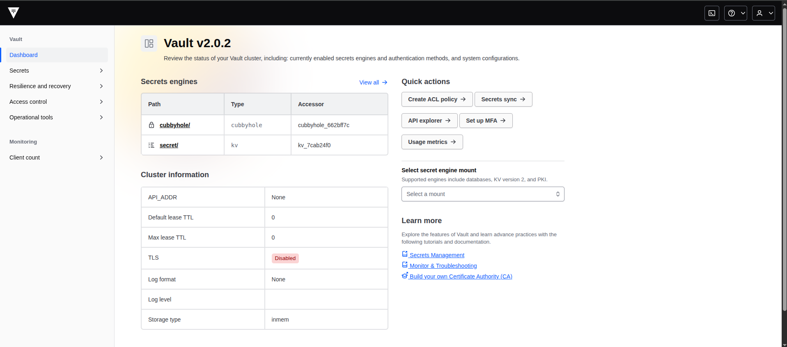
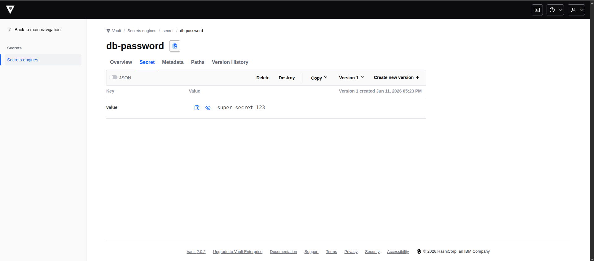
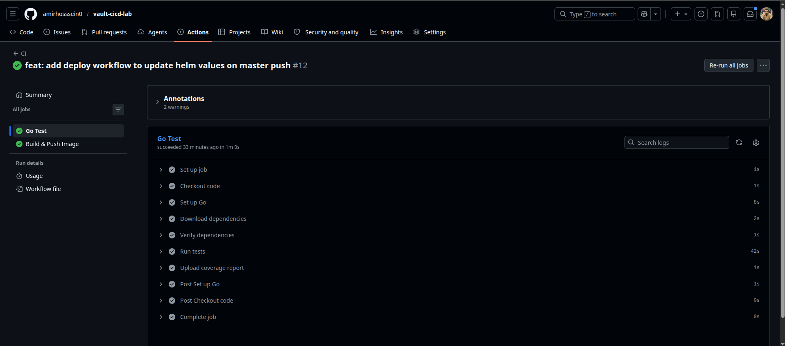
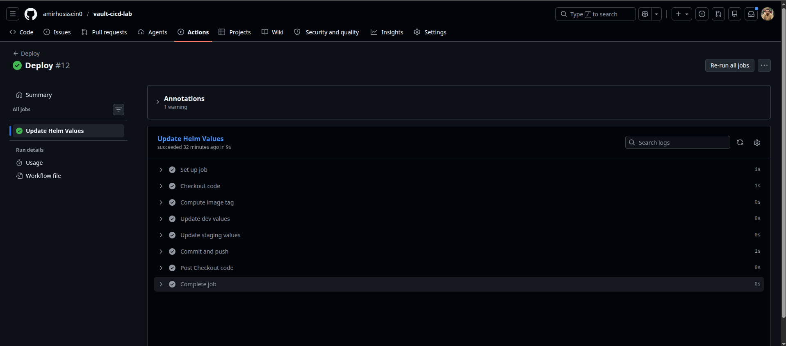
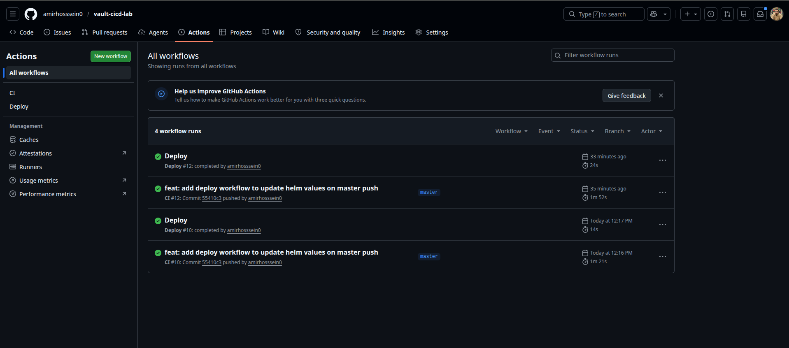
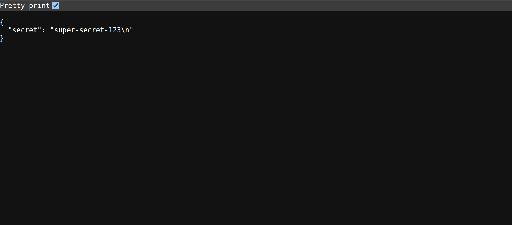

<div align="center">


&nbsp;&nbsp;&nbsp;


# vault-cicd-lab

**HashiCorp Vault + GitHub Actions — Secrets Management on Kubernetes**


</div>

---

## What is this?

A production-pattern secrets management lab demonstrating how to eliminate hardcoded secrets from code, ConfigMaps, and git entirely.

Secrets live in **HashiCorp Vault**. Pods receive them via **Vault Agent Injector** at runtime — no secret ever touches the codebase or the cluster manifests.

---

## How it works

```
Developer pushes code
  └── GitHub Actions CI
        ├── Go tests + coverage
        ├── Build Docker image
        └── Push to Docker Hub (branch-sha tag)
              └── Deploy workflow
                    └── Updates gitops/dev/values.yaml + gitops/staging/values.yaml
                          └── ArgoCD detects change → syncs cluster

Pod starts on Kubernetes
  └── Vault Agent Injector (sidecar)
        └── Authenticates via Kubernetes ServiceAccount
              └── Reads secret from Vault
                    └── Writes to /vault/secrets/db-password
                          └── App reads file → serves via /secret endpoint
```

**No secret is ever stored in git, environment variables, or ConfigMaps.**

---

## Architecture

```
                    ┌─────────────────────────────────────────┐
                    │           AKS / k3s Cluster              │
                    │                                          │
GitHub Actions ─────┼──► ArgoCD ──► Helm Chart                │
                    │                    │                     │
                    │              ┌─────┴──────┐              │
                    │              │    Pod      │              │
                    │              │  ┌────────┐ │              │
                    │              │  │  App   │ │              │
                    │              │  └───▲────┘ │              │
                    │              │      │      │              │
                    │              │  ┌───┴────┐ │              │
                    │              │  │ Vault  │◄├──── Vault    │
                    │              │  │ Agent  │ │              │
                    │              │  └────────┘ │              │
                    │              └─────────────┘              │
                    └─────────────────────────────────────────┘
```

---

## Stack

| Tool | Role |
|---|---|
| **HashiCorp Vault** | Secrets storage and management |
| **Vault Agent Injector** | Sidecar that injects secrets into pods at runtime |
| **Kubernetes Auth Method** | Pods authenticate to Vault via ServiceAccount |
| **Go + Gin** | API with `/health`, `/ready`, `/version`, `/secret` |
| **Helm v3** | Kubernetes packaging with Vault annotations |
| **ArgoCD** | GitOps — auto-sync on values.yaml change |
| **GitHub Actions** | CI: test → build → push / CD: update values |
| **Docker Hub** | Container registry |
| **k3s** | Local Kubernetes cluster |

---

## Screenshots

### Vault Dashboard


### Secret stored in Vault


### CI Pipeline — Go Test + Build & Push


### Deploy Pipeline — Helm Values Updated


### Both Workflows Green


### /secret endpoint — Secret injected successfully


---

## How to Run

### Prerequisites

- [k3s](https://k3s.io/) or any Kubernetes cluster
- [Helm v3](https://helm.sh/docs/intro/install/)
- [kubectl](https://kubernetes.io/docs/tasks/tools/)
- [ArgoCD](https://argo-cd.readthedocs.io/en/stable/getting_started/)
- Docker Hub account

### 1. Install Vault

```bash
helm repo add hashicorp https://helm.releases.hashicorp.com
helm repo update

helm install vault hashicorp/vault \
  --namespace vault \
  --create-namespace \
  --set "server.dev.enabled=true" \
  --set "injector.enabled=true"
```

### 2. Configure Vault

```bash
# Copy setup script into pod and run
kubectl cp vault/auth.sh vault/vault-0:/tmp/auth.sh
kubectl exec -it vault-0 -n vault -- /bin/sh /tmp/auth.sh

# Create secret
kubectl exec -it vault-0 -n vault -- vault kv put secret/db-password value="your-secret"
```

### 3. Create Kubernetes secrets

```bash
# Docker Hub
kubectl create secret docker-registry dockerhub \
  --docker-username=<username> \
  --docker-password=<token> \
  --docker-server=https://index.docker.io/v1/ \
  --namespace develop

# TLS
openssl req -x509 -nodes -days 365 -newkey rsa:2048 \
  -keyout tls.key -out tls.crt -subj "/CN=app-chart.local"

kubectl create secret tls app-chart-tls \
  --cert=tls.crt --key=tls.key --namespace develop

rm tls.crt tls.key
```

### 4. Create ServiceAccounts

```bash
kubectl create serviceaccount app -n develop
kubectl create serviceaccount app -n staging
```

### 5. Bootstrap with App of Apps

```bash
kubectl apply -f app-of-apps.yaml
```

### 6. Add local DNS

```bash
echo "127.0.0.1 dev.app-chart.local staging.app-chart.local" | sudo tee -a /etc/hosts
```

### 7. Test

```bash
kubectl port-forward svc/app-dev-svc 8080:8080 -n develop
curl localhost:8080/secret
# {"secret":"your-secret"}
```

---

## Vault Setup Scripts

| File | Purpose |
|---|---|
| `vault/auth.sh` | Configure Kubernetes Auth Method, policy, and role |
| `vault/policy.hcl` | ACL policy — read-only access to db-password |
| `vault/secrets.sh` | Create initial secrets in Vault |

---

## CI/CD Pipeline

### CI (`ci.yml`) — triggers on every push

```
push to any branch
  └── Go Test (working-directory: ./app)
        ├── go mod download + verify
        ├── go test -race -coverprofile
        └── upload coverage artifact
  └── Build & Push (needs: test)
        ├── compute tag: branch-sha (e.g. master-9ddcb6f)
        ├── docker buildx build
        └── push to Docker Hub
```

### Deploy (`deploy.yml`) — triggers after CI on master

```
CI success on master
  └── compute image tag
  └── sed update gitops/dev/values.yaml
  └── sed update gitops/staging/values.yaml
  └── git commit + push
        └── ArgoCD detects → sync → new pod
```

---

## API Endpoints

| Endpoint | Description |
|---|---|
| `GET /health` | Liveness — `{ "status": "up" }` |
| `GET /ready` | Readiness — `{ "status": "ready" }` |
| `GET /version` | App version and environment |
| `GET /secret` | Reads injected secret from `/vault/secrets/db-password` |

---

## GitHub Actions + Vault (Production)

In production, GitHub Actions connects to Vault via **OIDC** — no static tokens:

```yaml
- name: Get secret from Vault
  uses: hashicorp/vault-action@v3
  with:
    url: https://vault.example.com
    method: jwt
    role: github-actions
    secrets: secret/data/db-password value | DB_PASSWORD
```

For local development, a static Vault token is used via `VAULT_TOKEN` GitHub Secret.

---

<div align="center">
<sub>Part of a DevOps portfolio — <a href="https://github.com/amirhosssein0/k8s-gitops-lab">k8s-gitops-lab</a> | <a href="#">uptime-monitor</a></sub>
</div>